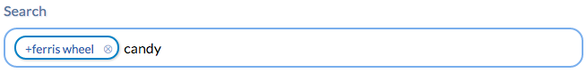

# Tokchi
jQuery plugin that adds MacOS-style tokens or Android-style chips to a text input field, including
an auto-completion dropdown box that shows up as you type.



This plugin was mainly created for a keyword-based search bar that automatically
recognizes keywords and replaces them with MacOS-style input field tokens.

## What else is it good for?

### Email Recipients
Tokchi can also be used for recognizing recipients from a contacts database:


Just take a look at `demo/email.html`.

### Online Communities: @/+User Name
Similar to Google+ or Facebook auto-completion, Tokchi could also be used for dynamic message input fields in
order to select and highlight the name of a community user you want to include in a message.

## Usage
This plugin adds a new jQuery function called `tokchify` that accepts an options parameter:

```
$('#my-search-bar').tokchify({
    onSearchKeyword : function (tokchi, keyword) {
        var result = doSomeSearch(keyword);
        tokchi.setSearchResult(result);
    }
});
```

That's almost enough to set up a very basic Tokchi input field instance.
Of course you also want to customize the heck out of it.
Take a look at the HTML and CSS files in the `demos` directory for getting some inspiration.

### Making it Pretty
One more thing you need to do is define a couple of CSS classes:

- `tokchi-token` styles a `<div>` tag that wraps a token
- `tokchi-dropdown` is the class that styles a floating `<ul>` which contains the auto-completion suggestion items
- `tokchi-dropdown-item` is the class that styles an auto-completion suggestion list item
- `tokchi-dropdown-item-selected` is added to the currently selected auto-completion suggestion list item

### Initialization Options
The `tokchify` function accepts an options argument with any of the following properties:

| Property | Type | Description |
|----------|------|-------------|
| autoFocus | `boolean` | If set to true (= default), the Tokchi search bar is given focus when ready. |
| onReady | `function(tokchi)` | Called when Tokchi object is ready. See [methods section](#methods) below for available Tokchi methods. |
| onSearchKeyword | `function(tokchi, keyword)` | Keyword search handler function. Must call `tokchi.setSearchResult(result)` when search result is available. |
| onChange | `function(tokchi)` | Called when the user has added or removed one or more tokens from the input field. |
| onCreateToken | `function(tokchi, tokenHTMLNode, tokenObj)` | Function that adds the label and optional other content to a new token. |
| onCreateDropdownItem | `function(tokchi, itemHTMLNode, resultItem)` | Function that adds the label and optional other content to an auto-completion dropdown list item. |
| onUnwrapToken | `function(tokchi, tokenHTMLNode, tokenObj)` | Function that returns the token label string in case a token gets "unwrapped" for editing. |
| onPressReturn | `function(tokchi)` | Called when the return key has been pressed in the input field, while the auto-completion dropdown box is closed. Override this method if you want to act on this event, e.g. send the message from the input field to a server. This function is expected to return a `boolean`. If it returns `true` the enter key press event won't be propagated to the input field, essentially suppressing line breaks in the input. |
| dropdownElement | `string | DOMNodeElement` | Optional `<ul>` container object for the suggestion dropdown box. Can be a CSS selector string or an actual DOM node element. If not specified, an element will be automatically created and added as a sibling to the search input field. |
| cssClasses | `object` | Contains an internally used map of the following CSS class names: `tokchi-token`, `tokchi-token-close-button`, `tokchi-dropdown`, `tokchi-dropdown-item` and `tokchi-dropdown-item-selected`. |
| dropdownStyle | `string` |`follows` = dropdown box will open up under current cursor position, `fixed` = dropdown box will appear under input field. |
| searchKeywordDelimiter | `RegExp` | Optional regular expression for detecting boundaries between keywords to search for. By default this regex covers white-space and western punctuation. If set to `null` only existing token objects act as boundaries. |

The source file `src/jquery.tokchi.js` contains more detailed documentation for each option (see `defaultOptions` object).

### Tokchi Object Methods
<a name="methods"></a>

| Method | Arguments | Description |
|--------|-----------|-------------|
| addToken | `{object} tokenObj` | Programmatically adds a token to the end of the input field. |
| removeToken | `{DOMElementNode} tokenHTMLNode` | Programmatically removes a token from the input field. |
| setValue | `string | array` | Sets the input field value. String arguments are used as text value for the field. Array arguments are expected to be sequences of strings and / or token objects (see `getValue` function). If no argument is specified the input field will be cleared. | 
| getTokens | | Returns a list of all token objects that are currently embedded in the input field. |
| getValue  | | Returns the current input text as an `array` of strings and token `object`s in the order of appearance. HTML formattings will be ignored. Example: `[ 'Hello ', {id : 123, label : '+Ferris'}, '! How are you?' ]` |
| setSearchResult | `{array} result` | Callback method for `onSearchKeyword` that sets the auto-completion result set of a token keyword search. The expected argument can be null or an array of `object`s that contain the individual token labels and arbitrary other properties (e.g. an `id` for identifying a token). The default label property is called `label`. |

## Is it production ready?
This plugin is currently under development for a website project and may undergo a couple of fixes
here and there. I cannot guarantee that it's ready for prime time, yet. For the time being I will only
try to make it work as good as possible for one specific purpose: recognizing and adding keywords
to a search page.

There are a few issues, most notably on Android browsers where Android's auto-correction does
really bizarre things when editing an inserted token. I don't have any idea what the cause may be, so if you
have an idea how to fix that, send me a pull request, please :-)

Other than that Tokchi seems to be pretty stable on Safari (Mac and iOS), Firefox and Google Chrome,
with some minor issues, that have to do with editing an existing token.

## How can I contribute?
Just create your own fork on GitHub, make your changes and create a pull request. I will review your contribution
as soon as I can. Thanks for your help!